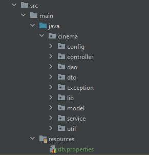
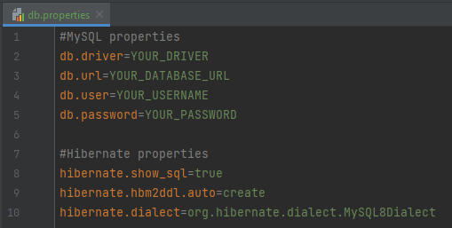
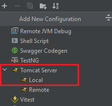

# CINEMA-APP🍿👀🎥
## Overview
``` java
    Currently, no business can fully function without a proper application. They help automate business processes,
 make the product more accessible, improve communication, etc. 
 In this project, a cinema application was developed that can meet these needs. Thanks to it,
 the user can view available sessions, add tickets to the cart, and make an order. 
 Also, the authentication process ensures data security
```

# Project structure


__The project includes the following elements:__
- _config:_ Configuration files
- _controllers:_ Controllers for authentication, making an order, creating session etс
- _dao:_ Classes for accessing database tables
- _dto:_ Models of objects that the user interacts with
- _exceptions:_ There are custom exceptions
- _lib:_ Contains custom validators
- _model:_ Includes User, Movie, Order, CinemaHall models
- _service:_ Provides multi-tiered architecture
- _util:_ Contains DateTimePattern

# Functionality of the service:
__You can do the following:__
- Authenticate as a user or admin
- Register a new user
- Get available movieSessions, cinemaHalls, movies
- Find user by email
- Add ticket to cart
- Make order, get order history
- Update and delete movieSessions
- Log out of your account

# Technologies:
1. Spring Core
1. Spring MVC
1. Spring Security 
2. Hibernate 
3. Maven 
4. MySQL
4. XML(eXtensible Markup Language)

# How to start a project
To run this application, you need to install the following software:
- __Tomcat 9.0.50__
- __MySQL 8.0.31__
- __Workbench 8.0__

First of all, you need to connect the database to the project, for this you need to enter your data in the resources/__db.properties__



Then you should select the appropriate Tomcat configuration and click __"Run"__ or use a combination __Shift + F10__




# Database schema

